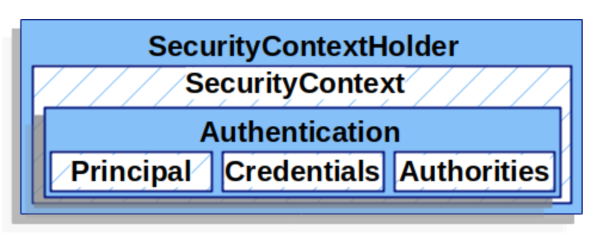
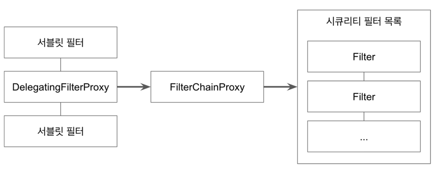

# spring-security

[Inflearn 백기선-스프링 시큐리티](https://www.inflearn.com/course/%EB%B0%B1%EA%B8%B0%EC%84%A0-%EC%8A%A4%ED%94%84%EB%A7%81-%EC%8B%9C%ED%81%90%EB%A6%AC%ED%8B%B0/) 수강 

### SecurityContextHolder와 Authentication

- 기본적으로 SecurityContextHolder는 ThreadLocal을 사용해서 정보를 저장하기 때문에, 메소드에 직접 SecurityContext를 넘기지 않아도 동일한 스레드라면 항상 SecurityContext에 접근할 수 있다.
- SecurityContextHodler에서 Authentication을 가져오는 방법
```java
String username = SecurityContextHolder.getContext().getAuthentication();
```
- Authentication : Principal, GrantAuthroity를 제공
- Pricipal
  - "누구"에 해당하는 정보
  - UserDetailsService에서 리턴한 객체
  - 객체는 UserDetails 타입
- UserDetails
  - 애플리케이션이 가지고 있는 유저 정보와 스프링 시큐리티가 사용하는 Authentication
- UserDetailsService
  - 유저 정보를 UserDetails 타입으로 가져오는 DAO (Data Access Object) 인터페이스.


### AuthenticationManager와 Authentication
> 스프링 시큐리티의 인증(Authentication)은 AuthenticationManger가 한다.

```java
Authentication authenticate(Authentication authentication) throws AuthenticationException;
```
- 인자로 받은 `Authentication`이 유효한 인증인지 확인하고 `Authentication` 객체를 리턴한다.

### 스프링 시큐리티 Filter와 FilterChainProxy
- 스프리 시큐리티가 제공하는 필터들
1. WebAsyncManagerIntergrationFilter
2. SecurityContextPersistenceFilter
3. HeaderWriterFilter
4. CsrfFilter
5. LogoutFilter
6. UsernamePasswordAuthenticationFilter 
7. DefaultLoginPageGeneratingFilter
8. DefaultLogoutPageGeneratingFilter
9. BasicAuthenticationFilter
10. RequestCacheAwareFtiler
11. SecurityContextHolderAwareReqeustFilter 
12. AnonymouseAuthenticationFilter
13. SessionManagementFilter 
14. ExeptionTranslationFilter 
15. FilterSecurityInterceptor

이 모든 필터는 **FilterChainProxy**가 호출한다.

### DelegatingFilterProxy와 FilterChainProxy
- DelegatingFilterProxy
  - 서블릿 필터 처리를 스프링에 들어있는 빈으로 위임하고 싶을 때 사용하는 서블릿 필터
  - 스프링 부트를 사용할 때는 자동으로 등록 된다. (SecurityFilterAutoConfiguration)
- FilterChainProxy
  - 보통 “springSecurityFilterChain” 이라는 이름의 빈으로 등록된다.


