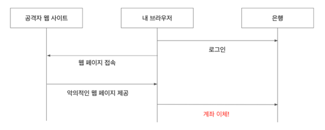

# spring-security

[Inflearn 백기선-스프링 시큐리티](https://www.inflearn.com/course/%EB%B0%B1%EA%B8%B0%EC%84%A0-%EC%8A%A4%ED%94%84%EB%A7%81-%EC%8B%9C%ED%81%90%EB%A6%AC%ED%8B%B0/) 수강 

### SecurityContextHolder와 Authentication

- 기본적으로 SecurityContextHolder는 ThreadLocal을 사용해서 정보를 저장하기 때문에, 메소드에 직접 SecurityContext를 넘기지 않아도 동일한 스레드라면 항상 SecurityContext에 접근할 수 있다.
- SecurityContextHodler에서 Authentication을 가져오는 방법
```java
String username = SecurityContextHolder.getContext().getAuthentication();
```
- Authentication : Principal, GrantAuthroity를 제공
- Pricipal
  - "누구"에 해당하는 정보
  - UserDetailsService에서 리턴한 객체
  - 객체는 UserDetails 타입
- UserDetails
  - 애플리케이션이 가지고 있는 유저 정보와 스프링 시큐리티가 사용하는 Authentication
- UserDetailsService
  - 유저 정보를 UserDetails 타입으로 가져오는 DAO (Data Access Object) 인터페이스.


### AuthenticationManager와 Authentication
> 스프링 시큐리티의 인증(Authentication)은 AuthenticationManger가 한다.

```java
Authentication authenticate(Authentication authentication) throws AuthenticationException;
```
- 인자로 받은 `Authentication`이 유효한 인증인지 확인하고 `Authentication` 객체를 리턴한다.

### 스프링 시큐리티 Filter와 FilterChainProxy
- 스프리 시큐리티가 제공하는 필터들
1. WebAsyncManagerIntergrationFilter
2. SecurityContextPersistenceFilter
3. HeaderWriterFilter
4. CsrfFilter
5. LogoutFilter
6. UsernamePasswordAuthenticationFilter 
7. DefaultLoginPageGeneratingFilter
8. DefaultLogoutPageGeneratingFilter
9. BasicAuthenticationFilter
10. RequestCacheAwareFtiler
11. SecurityContextHolderAwareReqeustFilter 
12. AnonymouseAuthenticationFilter
13. SessionManagementFilter 
14. ExeptionTranslationFilter 
15. FilterSecurityInterceptor

이 모든 필터는 **FilterChainProxy**가 호출한다.

### DelegatingFilterProxy와 FilterChainProxy
- DelegatingFilterProxy
  - 서블릿 필터 처리를 스프링에 들어있는 빈으로 위임하고 싶을 때 사용하는 서블릿 필터
  - 스프링 부트를 사용할 때는 자동으로 등록 된다. (SecurityFilterAutoConfiguration)
- FilterChainProxy
  - 보통 “springSecurityFilterChain” 이라는 이름의 빈으로 등록된다.


### AccessDecisionManager
- 인가 결정을 내리는 인터페이스로, 구현체 3가지를 기본으로 제공한다.
  - AffirmativeBased : 승인 Voter가 1개 이상 (기본 전략)
  - ConsensusBased : 과반수
  - UnanimouseBased : 모든 Voter 승인
- AccessDecisionVoter
  - 해당 Authentication이 특정한 Object에 접근할 때 필요한 ConfigAttributes를 만족하는지 확인한다.
  - WebExpressionVoter : 웹 시큐리티에서 사용하는 기본 구현체, ROLE_XXX 가 매칭되는지 확인
  - RoleHierarchyVoter : 계층형 ROLE 지원, ADMIN > MANAGER > USER
    - 스프링 시큐리티는 ADMIN, USER 등의 ROLE의 권한 정도를 모르기 때문에 customize 필요 시 사용한다.

### ignoring
WebSecurity의 ignoring()을 사용해서 시큐리티 필터 적용을 제외할 요청을 설정할 수 있다.
```java
@Override
public void configure(WebSecurity web) throws Exception {
    web.ignoring().requestMatchers(PathRequest.toStaticResources().atCommonLocations());
}
```
- ignoring() vs permitAll()
  - 같은 결과를 볼 수는 있지만 스프링 시큐리티 필터가 적용된다는 차이가 있다.
  - Ingore is a filter that completely bypasses spring security, which is equivalent to not taking spring security.
  - PermitAll does not bypass spring security, which includes both logged-in and anonymous.

### Async 웹 MVC를 지원하는 필터 : WebAsyncManagerIntegrationFilter
- 스프링 MVC의 Async의 기능(핸들러에서 Callable을 리턴할 수 있는 기능)을 사용할 때에도 SecurityContext를 공유하도록 도와주는 필터

### @Async
- `@Async`를 사용한 서비스를 호출하는 경우 Thread가 다르기 떄문에 SecurityContextHolder를 공유받지 못한다.
- SecurityContext를 자식 Thread에도 공유하기 위해서는 아래와 같이 추가적인 설정이 필요하다.
```java
    SecurityContextHolder.setStrategyName(SecurityContextHolder.MODE_INHERITABLETHREADLOCAL);
```

### SecurityContext 영속화 필터 : SecurityContextPersistenceFilter
- SecurityContextRepository를 사용해서 기존의 SecurityContext를 읽어오거나 초기화한다.

### 시큐리티 관련 헤더 추가하는 필터 : HeaderWriterFilter
응답 헤더에 시큐리티 관련 헤더를 추가해주는 필터
- XContentTypeOptionsHeaderWriter: 마임 타입 스니핑 방어.
- XXssProtectionHeaderWriter: 브라우저에 내장된 XSS 필터 적용.
- CacheControlHeadersWriter: 캐시 히스토리 취약점 방어. 
- HstsHeaderWriter: HTTPS로만 소통하도록 강제.
- XFrameOptionsHeaderWriter: clickjacking 방어.

### CSRF 어택 방지 필터 : CsrfFilter
- 인증된 유저의 계정을 사용해 악의적인 변경 요청을 만들어 보내는 기법
- CORS를 사용할 때 특히 주의 필요
- 의도된 사용자만 리소스를 변경할 수 있도록 허용하는 필터
  - CSRF 토큰을 사용하여 방지 (클라이언트에서 보낸 토큰을 서버 값과 비교함)
- JSP에서 스프링 MVC가 제공하는 \<form:form> 태그 또는 타임리프 2.1+ 버전을 사용하면 폼에 CSRF 히든 필드가 기본으로 생성됨



### 로그아웃 처리 필터 : LogoutFilter
- 여러 LogoutHandler를 사용하여 로그아웃 시 필요한 처리를 하며 이후에는 LogoutSuccessHandler를 사용하여 로그아웃 후 처리를 한다.
- LogoutHandler
  - CsrfLogoutHandler
  - SecurityContextLogoutHandler
- LogoutSuccessHandler
  - SimpleUrlLogoutSuccessHandler
```java
http.logout()
        .logoutUrl("/logout")
        .logoutSuccessUrl("/")
        .logoutRequestMatcher() 
        .invalidateHttpSession(true) 
        .deleteCookies() 
        .addLogoutHandler() 
        .logoutSuccessHandler();
```

### 폼 인증 처리 필터 : UsernamePasswordAuthenticationFilter
> 폼 로그인을 처리하는 필터
- 사용자가 폼에 입력한 usernamer과 password로 Authentication을 만들고 AuthenticationManger를 사용하여 인증을 시도한다.
- AuthenticationManger(ProviderManager)는 여러 AuthenticationProvider를 사용하여 인증을 시도하는데,
  그 중 DaoAuthenticationProvider는 UserDetailService를 사용하여 UserDetails 정보를 가져와 사용자가 입력한 password와 비교한다.

### DefaultLoginPageGeneratingFilter
> 기본 로그인 폼 페이지를 생성해주는 필터
```java
http.formLogin()
        .usernameParameter("id")
        .passwordParameter("pw");
```

### Basic 인증 처리 필터 : BasicAuthenticationFilter
- Basic 인증이란?
  - 요청 헤더에 username, password를 실어보내면 브라우저 또는 서버가 그 값을 읽어서 인증하는 방식
  - 보안에 취약하기 때문에 HTTPS를 사용할 것을 권장

### 요청 캐시 필터 : RequestCacheAwareFilter
- 현재 요청과 관련 있는 캐시된 요청이 있는지 찾아서 적용하는 필터
  - 캐시된 요청이 없다면, 현재 요청 처리
  - 캐시된 요청이 있다면, 해당 캐싱된 요청 처리

### 익명 인증 필터 : AnonymousAuthenticationFilter
- 현재 SecurityContext에 Authentication이 null이면 익명 Authentication을 만들어 넣어주고 null이 아니면 아무일도 하지 않는다.

### 세션 관리 필터 : SessionManagementFilter
- 세션 변조 방지 전략 설정 : sessionFixation
- 유효하지 않은 세션을 리다이렉트 시킬 URL 설정
  - invalidSessionUrl
- 동시성 제어 : maximumSessions
  - 추가 로그인을 막을지 여부 설정
- 세션 생성 전략 : sessionCreationPolicy
  - IF_REQUIRED
  - NEVER
  - STATELESS
  - ALWAYS
```java
        http.sessionManagement()
            .maximumSessions(1);  // 1개의 세션만 허용
```

### 인증/인가 예외 처리 필터 : ExceptionTranslationFilter
- 인증, 인가 에러 처리를 담당하는 필터
- AuthenticationEntryPoint
- AccessDeniedHandler

### 인가 처리 필터 : FilterSecurityInterceptor
- HTTP 리소스 시큐리티를 담당하는 필터
- AccessDecisionManager를 사용하여 인가를 처리한다.
```java
http.authorizeRequests()
        .mvcMatchers("/", "/info", "/account/**", "/signup")
        .permitAll() 
        .mvcMatchers("/admin")
        .hasAuthority("ROLE_ADMIN") 
        .mvcMatchers("/user")
        .hasRole("USER") 
        .anyRequest()
        .authenticated() 
        .expressionHandler(expressionHandler());
```
### 토큰 기반 인증 필터 : RememberMeAuthenticationFilter
- 세션이 사라지거나 만료되더라도 쿠키 또는 DB를 사용하여 저장된 토큰 기반으로 인증을 지원하는 필터
```java
http.rememberMe() 
        .userDetailsService(accountService) 
        .key("remember-me-sample");
```

### 커스텀 필터 추가
```java
http.addFilterAfter(new LoggingFilter(), UsernamePasswordAuthenticationFilter.class);
http.addFilterAfter(new LoggingFilter(), UsernamePasswordAuthenticationFilter.class);
```

### 메소드 시큐리티
```java
@Configuration
@EnableGlobalMethodSecurity(securedEnabled = true, prePostEnabled = true, jsr250Enabled = true)
public class MethodSecurityConfig extends GlobalMethodSecurityConfiguration {
  @Override
  protected AccessDecisionManager accessDecisionManager() {
    RoleHierarchyImpl roleHierarchy = new RoleHierarchyImpl(); roleHierarchy.setHierarchy("ROLE_ADMIN > ROLE_USER"); AffirmativeBased accessDecisionManager = (AffirmativeBased)
            super.accessDecisionManager(); accessDecisionManager.getDecisionVoters().add(new
            RoleHierarchyVoter(roleHierarchy)); return accessDecisionManager;
  }
}
```
- @Secured와 @RollAllowed
  - 메소드 호출 이전에 권한을 확인한다.
  - 스프링 EL을 사용하지 못한다.
- @PreAuthorize와 @PostAuthorize
  - 메소드 호출 이전 @있다.

### @AuthenticationPrincipal
웹 MVC 핸들러 아규먼트로 Principal 객체를 받을 수 있다. 커스텀 유저 클래스 구현하기
```java
public class UserAccount extends User { // User 상속
    
  private Account account;
  
  public UserAccount(Account account) { 
      super(account.getUsername(), account.getPassword(), List.of(new SimpleGrantedAuthority("ROLE_" + account.getRole()))); this.account = account;
  }
  
  public Account getAccount() { 
      return account;
  } 
  
}

// 사용방법
@AuthenticationPrincipal UserAccount userAccount;
```
- UserDetailsService 구현체에서 리턴하는 객체를 매개변수로 받을 수 있다.
  - 그 안에 들어있는 Account객체를 getter를 통해 참조할 수 있다.
